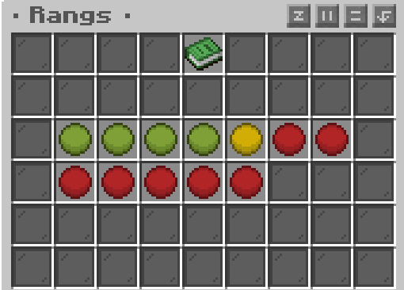
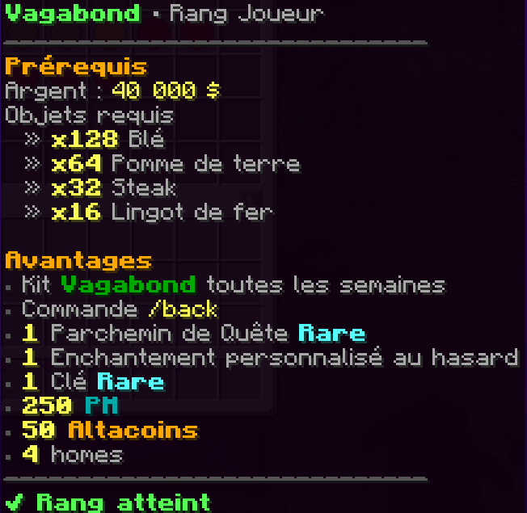

# Les rangs F2W

Le système de rangs vous permets de progresser au sein du serveur grâce à la commande **/rangs.**

<figure><figcaption></figcaption></figure>

Pour accéder au rangs supérieur, vous devez réunir certaines condition comme:

* une quantité spécifique de ressources
* de l'argent obtenable via: [gagner-de-largent.md](../introduction/gagner-de-largent.md "mention")
* ainsi que le rangs précédent.

<figure><figcaption></figcaption></figure>

Le système de rangs vous permet une expérience agréable, vous encourageant à explorer, récolter, commercer et développer votre économie, tout en récupérant petit à petit des avantages spécifiques



Il s'agit du rangs de base quand vous vous connecter sur le serveur pour la première fois.

**Avantages:**

* kit: paysan
* 2 homes
* 3 métiers max



**Prérequis:**

* argent: 40 000$
* 128 (2\*64) Blé
* 64 Pomme de terre
* 32 steak
* 16 lingot de fer

**Avantages:**

* kit: Vagabond ( toute les semaines)&#x20;
* accès au **/back**
* 1 Parchemin de quête <mark style="color:blue;">**RARE**</mark>
* <mark style="color:$warning;">**1 enchantement personnalisé au hasard**</mark>
* 1 clés rare
* 250 PM
* 50 Altacoins
* 4 homes



**Prérequis:**&#x20;

* Argent: 120 000$
* 64 carotte dorée
* 32 lingot d'or
* 16 émeraudes
* 8 ender pearl

**Avantages:**

* kit Baroudeur (disponible toute les semaine)
* accès au **/sell hand**
* 1 parchemin de quête <mark style="color:purple;">**Epique**</mark>
* Multiplication de vente du /shop de <mark style="color:green;">**X1.1**</mark>
* 2 clés rares
* 300 PM
* 50 Altacoins



**Prérequis:**

* Argent: 200 000$
* 32 émeraude
* 16 diamant
* 8 larme de ghast
* 4 bloc de lapis-lazuli\
  \
  **Avantages:**
* kit Artisan (disponible toute les semaines)
* accès au **/disposal** ( allias: **/trash**) \[vous permet d'ouvrir un menu de destruction des items]
* 1 parchemin de quêtes <mark style="color:yellow;">**légendaire**</mark>
* <mark style="color:$warning;">**2 enchantement personnalisés aléatoire**</mark>&#x20;
* Multiplication du prix de vente dans le shop de <mark style="color:$success;">**X1.2**</mark>
* 1 Clé Epique
* 300 PM&#x20;
* 50 Altacoins
* 6 homrs



**Prérequis:**

* Argent: 400 000$
* 24 diamant
* 16 livre
* 3 tête de wither
* 2 oeil d'arreigner fermenté

\
**Avantages:**

* kit Erudit (disponible toute les semaine)
* accès au **/enderchest** ( allias: **/ec**) \[vous ouvre votre enderchest]
* Multiplication du prix de vente dans le shop de <mark style="color:$success;">**X1.3**</mark>
* 10 shops de joueurs max (voir: [les-coffres-de-ventes.md](les-coffres-de-ventes.md "mention") )
* 2 clés épique
* 400 PM
* 6 homes





**Prérequis:**

* Argent: 800 000$
* 32 diamant
* 16 bloc d'or
* 8 éclat de prismarine
* 1 nether star\
  \
  **Avantages:**
* kit écuyer (disponible toute les semaine)
* accès au /**repair** (vous permet de repair l'outils / armure dans votre main)
* accès au **/ptime** et **/pweather** -> Les modification ne s'appliquent que à vous
* 2 parchemins de quêtes <mark style="color:yellow;">**légendaire**</mark>
* <mark style="color:$warning;">**3 enchantement personnalisés aléatoire**</mark>&#x20;
* Multiplication du prix de vente dans le shop de <mark style="color:$success;">X1.4</mark>
* 6 métiers max
* 1 warp joueur (/pwarp OFFERT)
* 450 PM
* 7 homes



**Prérequis:**

* Argent: 1 600 000$
* 48 dimant
* 2 nether star
* 16 totem d'immortalité

**Avantages:**

* kit chevalier
* accès au /feed - /top - /bottom&#x20;
* 3 parchemins de quête <mark style="color:yellow;">**légendaire**</mark>
* Multiplication du prix de vente dans le shop de <mark style="color:$success;">**X1.5**</mark>
* <mark style="color:$warning;">**4 enchantement personnalisés aléatoire**</mark>&#x20;
* 4 clés épique
* 2 warp joueur (/pwarp) offert
* 500 PM
* 8 homes



**Prérequis:**

* **Argent: 4 000 000**
* **64 lingot de netherite**
* **4 nether star**
* **8 bloc d'émeraude**
* **16 patte de lapin**

**Avantages:**

* kit baron
* accès au /craft - /ext&#x20;
* 4 parchemin de quêtes <mark style="color:yellow;">**légendaire**</mark>
* <mark style="color:$warning;">**5 enchantement personnalisés aléatoire**</mark>&#x20;
* Multiplication du prix de vente dans le shop de <mark style="color:$success;">**X1.6**</mark>
* 7 métiers MAX
* 5 clés épique
* 1 clé rare
* 3 warp joueur (/pwarp) offert
* 550 PM
* 9 homes



**Prérequis:**

* **Argent: 5 500 000$**
* **3 balise**
* **8 nether star**
* **96 lingots de netherite**
* **32 bloc d'améthyste**

**Avantages:**

* kit Comte
* accès au /condense&#x20;
* Vous pouvez créer 2 villes
* 4 parchemin de quêtes <mark style="color:yellow;">**légendaire**</mark>
* 1 parchemin de quêtes spécial
* <mark style="color:$warning;">**5 enchantement personnalisés aléatoire**</mark>&#x20;
* Multiplication du prix de vente dans le shop de <mark style="color:$success;">**X1.65**</mark>
* 8 métiers max
* 5 clés épique
* 15 shops joueurs max
* 600 PM
* 10 homes



&#x20;**Prérequis:**

* **Argent: 8 000 000$**
* **4 balise**
* **12 nether star**
* **128 lingots de netherite**
* **64 membrane de phantom**

**Avantages:**

* kit Marquis
* accès au /heal
* 5 parchemin de quêtes <mark style="color:yellow;">**légendaire**</mark>
* <mark style="color:$warning;">**6 enchantement personnalisés aléatoire**</mark>&#x20;
* Multiplication du prix de vente dans le shop de <mark style="color:$success;">**X1.75**</mark>
* 6 clés épique
* 2 clés rare
* 4 warp joueur (/pwarp) offert
* 650 PM
* 11 homes



**Prérequis:**

* **Argent: 12 000 000$**
* **16 nether star**
* **48 lingot de netherite**
* **128 cuivre oxydé ciré**

**Avantages:**

* kit Archiduc
* accès au /fly
* 5 parchemin de quêtes <mark style="color:yellow;">**légendaire**</mark>
* 2 parchemin de quêtes Mystères
* <mark style="color:$warning;">**7 enchantement personnalisés aléatoire**</mark>&#x20;
* Multiplication du prix de vente dans le shop de <mark style="color:$success;">**X1.85**</mark>
* 9 métiers max
* 7 clés épique
* 20 shops joueurs max
* 700 PM
* 12 homes





**Prérequis:**

* **Argent: 20 000 000$**
* **8 balise**
* **24 étoile du nether**
* **256 lingot de netherite**
* **64 membrane de phantom**
* **8 crâne de wither**

**Avantages:**

* kit Parangon
* accès au /repair all - /tempgod (2min d'invisibilité)&#x20;
* Vous pouvez créer 3 villes
* 6 parchemin de quêtes <mark style="color:yellow;">**légendaire**</mark>
* 2 parchemin de quêtes mystère
* <mark style="color:$warning;">**8 enchantement personnalisés aléatoire**</mark>&#x20;
* Multiplication du prix de vente dans le shop de <mark style="color:$success;">**X2**</mark>
* 10 métiers max
* 8 clés épique
* 4 clés rare
* 25 shops joueurs max ET 5 objets par shop joueur MAX
* 750 PM
* 14 homes


